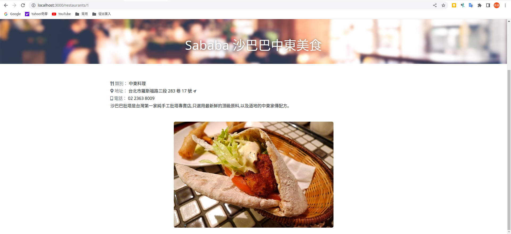

# 我的餐廳清單

一個餐廳清單專案，提供瀏覽及搜尋餐廳詳細資訊，如：餐廳類別、餐廳地址、餐廳電話等

## 功能說明

* 餐廳資料一覽
* 可搜尋餐廳名稱
* 點選各餐廳卡片，可瀏覽餐廳詳細資料


## 安裝與執行

1. 開啟終端機，進入專案目錄，並從github下載資料

```
> git clone https://github.com/erikku54/ac_restaurant-list-handlebars.git
```

2. 安裝套件

```
> cd ac_restaurant-list-handlebars
> npm install
```

3. 執行程式，啟動監聽

```
> npm run start
```

4. 啟動程式後，開啟瀏覽器並至http://localhost:3000開始瀏覽

## 畫面截圖





## 開發環境與套件

* VS Code - 編程環境
* node.js / express.js@4.18.2- 後端框架
* express-handlebars@7.0.2 - 樣板引擎
* bootstrap@5.2.3 - 樣式
* fontawesome@5.8.1 (CDN) - icon

## 作者

* **Eric Huang** 