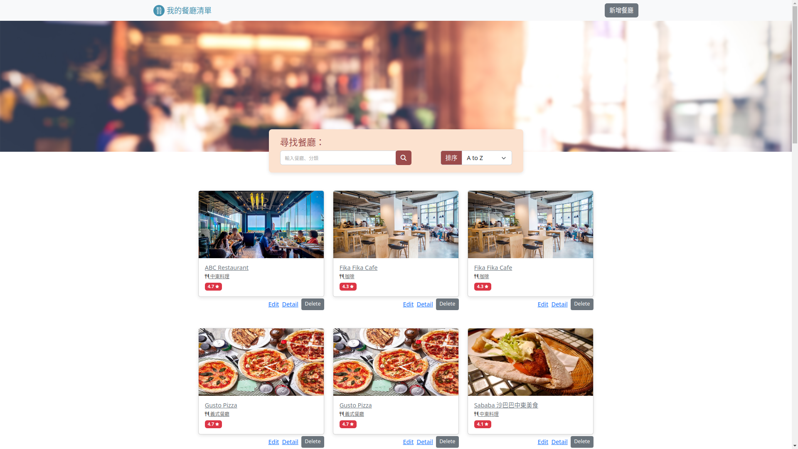

# 我的餐廳清單

一個餐廳清單專案，提供瀏覽及搜尋餐廳詳細資訊，如：餐廳類別、餐廳地址、餐廳電話等

## 功能說明

* 可以瀏覽全部所有餐廳, 並有排序功能
* 可搜尋餐廳名稱
* 點選各餐廳卡片，可瀏覽餐廳詳細資料
* 可以新增餐廳
* 可以修改餐廳資料
* 可以刪除餐廳


## 安裝與執行

1. 請先確認安裝有node.js及npm
2. 開啟終端機，進入專案目錄，並從github下載資料

```
> git clone https://github.com/erikku54/ac-restaurant-list-handlebars.git
```

3. 安裝套件

```
> cd ac_restaurant-list-handlebars
> npm install
```

4. 設定環境變數: 在專案資料夾下新增.env檔案，並填入你的MongoDB連線字串
```
MONGODB_URI = "<你的連線字串>"

```

5. 設定種子資料: 在終端機執行底下指令，匯入種子資料到資料庫裡
```
> npm run seed

```

6. 執行程式，啟動監聽

```
> npm run start
```

7. 啟動程式後，開啟瀏覽器並至http://localhost:3000開始瀏覽

## 畫面截圖




## 開發環境與套件

* VS Code - 編程環境
* node.js / express.js@4.18.2- 後端框架
* express-handlebars@7.0.2 - 樣板引擎
* bootstrap@5.2.3 - 樣式
* fontawesome@5.8.1 (CDN) - icon
* mongoose@7.0.2 - 連結MongoDB資料庫
* sweetalert2@11 (CDN) - 彈出視窗
* method-override@3.0.0 - 覆寫http方法

底下為開發中使用
* dotenv@16.0.3 - 管理環境變數
* eslint@8.36.0 - 代碼風格

## 作者

* **Eric Huang** 